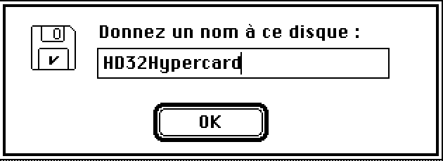
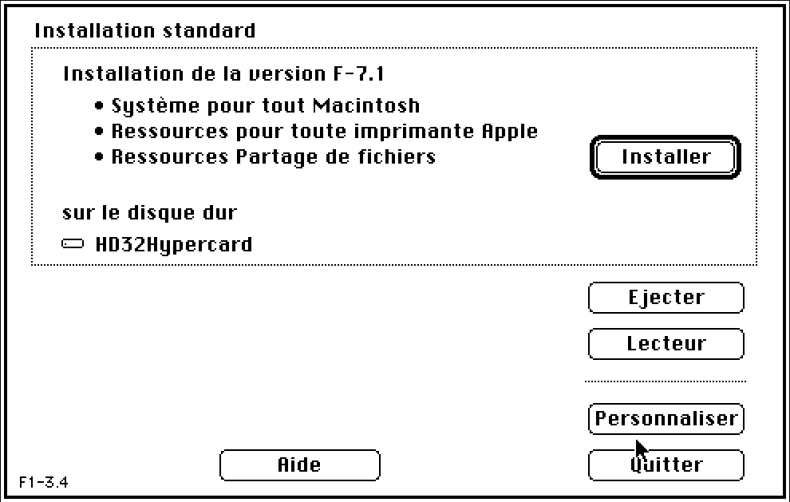
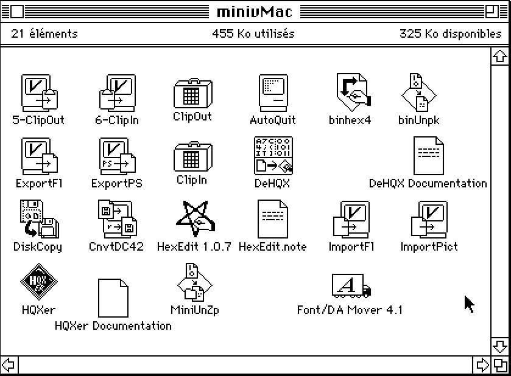
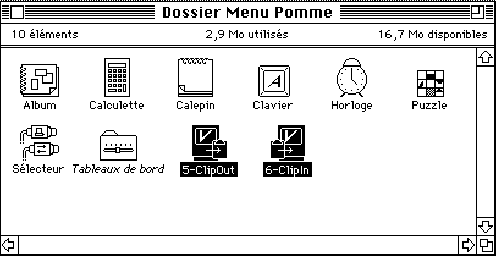

# Comment préparer un disque System 7 français pour minivMac ?

Ce document décrit les étapes à suivre et les fichiers nécessaires pour créer un disque de taille 20 Mo pour la programmation HYPERCARD sous System 7.1 français

1. Création d'un HD vierge
1. Installer System 7.1 FR
1. Installer Hypercard 2.4
1. Installer Clip-IN, Clip-OUT
1. Installer Stuffit 4.0.1 et Dropstuff 4.0

dd if=/dev/zero of=HD32Hypercard.dsk count=40960

1. Création d'un HD vierge

La stack ddSyntax permet d'obtenir la ligne de commande à lancer dans le Terminal sous MacOS :

dd if=/dev/zero of=HD32Hypercard.dsk count=40960

Le fichier obtenu doit être initialisé. C'est réalisé à la première ouverture du .dsk dans minivMac.

2. Installer System 7.1 FR
Pour cette étape, le dossier /installers/ sera nécessaire.

Quitter minivMac s'il est lancé.

* Aller dans le dossier /Installers/7.1FR
  
* Démarrer minivMac avec le disque "Install 1.img"

* Arrivé sur cet écran, faire glisser le disque préparé en 1 sur minivMac. Il ne se passe rien visuellement mais le disque a été monté et sera proposé sur l'écran suivant.

* Vérifier que le disque HD est bien proposé en destination

* Installer. À chaque demande de disquette, faire glisser le fichier correspondant sur minivMac. L'installation utilise les noms français pour désigner chaque disquette, mais les fichiers sur disque ont le nom anglais.

  

* Petit piège : Les disquettes "Imprimantes" et "Polices" sont inversées. Quand "Polices" sera demandé, utilisez "Printers" et vice-versa.

* Fin de l'installation

3. Installer Hypercard 2.4

Cette installation requiert 3000 Ko de RAM, c'est normalement le cas à ce stade de l'installation. On utilisera les fichiers suivants :
- HyperCard241.img
- HyperProgramming.image
- Cooking with HyperTalk.dsk

ATTENTION, ne pas utiliser l'installeur proposé sur l'écran initial.

Aller dans le dossier "Software Installers", puis dans "Hypercard Installer" et cliquer sur "Installer"

Les deux autres fichiers s'installent par simple copie :

- HyperProgramming.image
- Cooking with HyperTalk.dsk

Ils sont facultatifs mais vivement conseillés.

4. Installer Clip-IN, Clip-OUT

Pour cette installation, utilisez le disque "MinivMac.dsk" :
- copier le contenu du disque sur le disque dur

- copier les fichier Clip-In et Clip-Out dans le dossier 

5. Installer Stuffit 4.0.1 et Dropstuff 4.0

Cette installation se réalise avec les disquettes :

- stuffit_expander_40.dsk
- dropstuff_40.dsk

Il est requis de démarrer miniVmac sans charger les extensions (touche SHIFT enfoncée au démarrage).

## Ressources
Liste des modules nécessaires.

- ddSyntax.dsk
- /installers/
- HyperProgramming.image
- HyperCard241.img
- Cooking with HyperTalk.dsk
- MinivMac.dsk
- stuffit_expander_40.dsk
- dropstuff_40.dsk